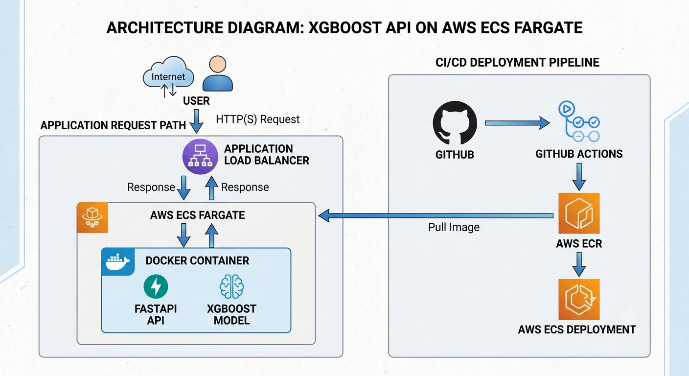
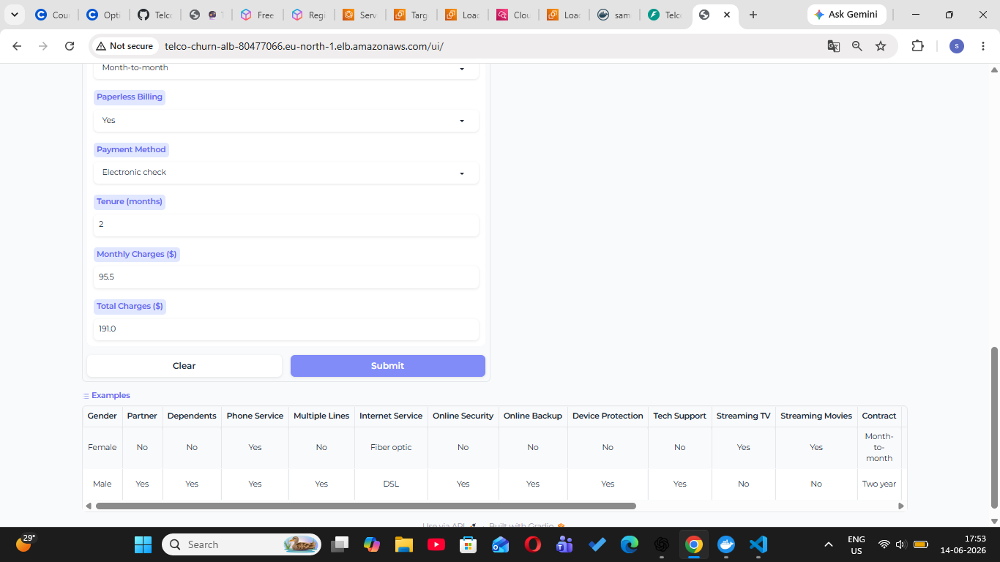
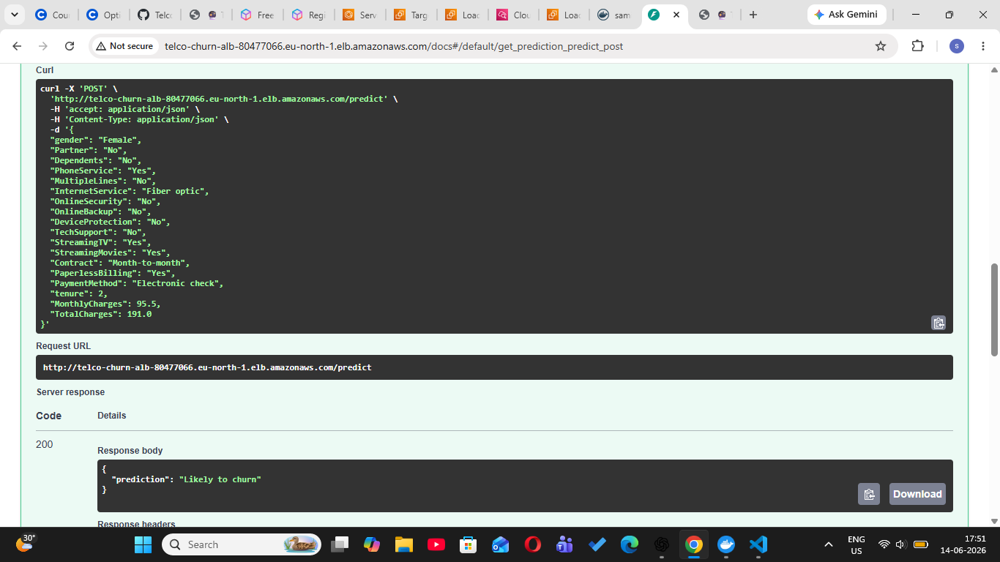
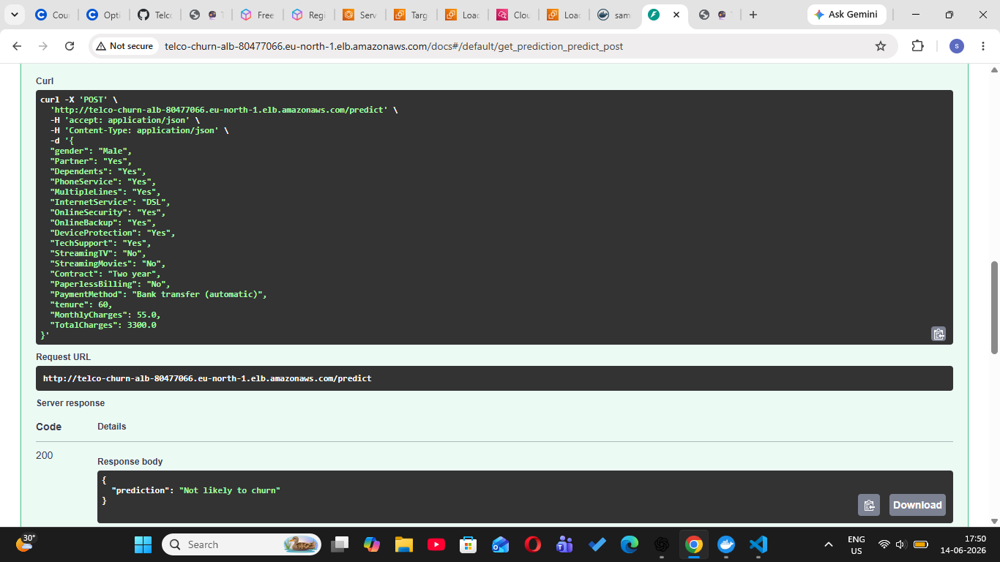
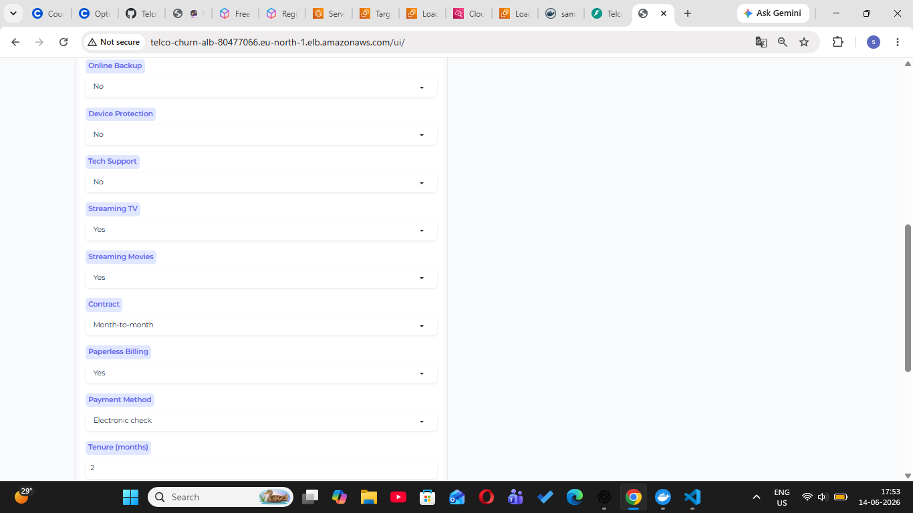
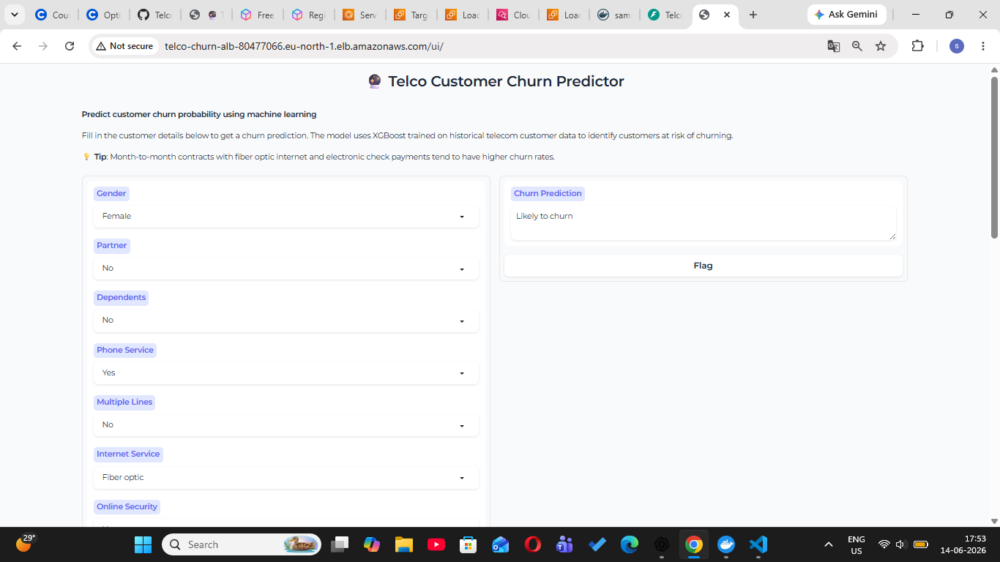

# 🚀 Telco Customer Churn Prediction Platform

### Production-Ready MLOps System for Real-Time Customer Churn Prediction


---

# 🌐 Live Demo

### Production Application

```text
http://telco-churn-alb-80477066.eu-north-1.elb.amazonaws.com/ui/
```

### API Documentation

```text
http://telco-churn-alb-80477066.eu-north-1.elb.amazonaws.com/docs
```

---

# 📌 Project Overview

This project is a production-grade machine learning platform designed to predict customer churn in the telecommunications industry.

The system leverages an XGBoost classification model and exposes real-time predictions through a FastAPI backend and interactive Gradio web interface.

The entire application is containerized with Docker, deployed on AWS ECS Fargate, and automatically updated through a GitHub Actions CI/CD pipeline.

Unlike traditional notebook-based machine learning projects, this solution demonstrates the complete ML lifecycle from model development to cloud deployment and production monitoring.

---

# 🏗️ Cloud Architecture



### Request Flow

```text
User
 │
 ▼
Application Load Balancer (AWS ALB)
 │
 ▼
AWS ECS Fargate Service
 │
 ▼
Docker Container
 │
 ├── FastAPI REST API
 ├── Gradio Web Interface
 └── XGBoost Prediction Engine
 │
 ▼
Prediction Response
```

---

# 🔄 CI/CD Pipeline

```text
Developer Push
      │
      ▼
GitHub Repository
      │
      ▼
GitHub Actions
      │
      ▼
Docker Image Build
      │
      ▼
AWS Elastic Container Registry (ECR)
      │
      ▼
AWS ECS Fargate Deployment
      │
      ▼
Production Environment
```

### Automated Workflow

* Source Code Validation
* Docker Image Build
* Container Registry Push
* ECS Deployment
* Service Update
* Cloud Deployment

---

# 📸 Application Screenshots

## Customer Churn Prediction Dashboard



---

## Prediction Example – High Churn Risk



---

## Prediction Example – Low Churn Risk



---

## Interactive API Documentation



---

## AWS Production Deployment



---

# 🎯 Business Problem

Customer churn directly impacts revenue and customer acquisition costs.

This system helps businesses:

* Detect high-risk customers early
* Improve customer retention strategies
* Reduce revenue loss
* Support proactive marketing campaigns
* Enable data-driven decision making

---

# 🤖 Machine Learning Pipeline

### Model

XGBoost Classifier

### Data Processing

* Missing Value Handling
* Feature Encoding
* Feature Engineering
* Data Validation
* Model Serialization

### Input Features

* Gender
* Partner
* Dependents
* Phone Service
* Multiple Lines
* Internet Service
* Online Security
* Online Backup
* Device Protection
* Tech Support
* Streaming TV
* Streaming Movies
* Contract
* Paperless Billing
* Payment Method
* Tenure
* Monthly Charges
* Total Charges

---

# 📈 Model Performance

| Metric    | Score  |
| --------- | ------ |
| Precision | 49.04% |
| Recall    | 82.09% |
| F1 Score  | 61.40% |
| ROC-AUC   | 83.67% |

### Key Insight

The model is optimized for customer retention use cases where identifying churn-risk customers is more valuable than maximizing precision.

A recall score above 82% ensures most potential churners are detected before customer loss occurs.

---

# ⚙️ Technology Stack

## Machine Learning

* XGBoost
* Scikit-Learn
* Pandas
* NumPy

## Backend

* FastAPI
* Uvicorn

## Frontend

* Gradio

## Experiment Tracking

* MLflow

## Containerization

* Docker

## Cloud Infrastructure

* AWS ECS Fargate
* AWS ECR
* AWS Application Load Balancer
* AWS CloudWatch

## DevOps

* GitHub Actions
* CI/CD Automation

---

# 📂 Repository Structure

```text
Telco-Customer-Churn-ML
│
├── .github/
│   └── workflows/
│       └── CI/CD Pipeline
│
├── assets/
│   ├── architecture.png
│   ├── web-ui.png
│   ├── swagger-docs.png
│   ├── aws-deployment.png
│   ├── prediction-positive.png
│   └── prediction-negative.png
│
├── notebooks/
├── scripts/
├── src/
│
├── Dockerfile
├── requirements.txt
└── README.md
```

---

# 🔌 REST API

### Prediction Endpoint

```http
POST /predict
```

### Example Request

```json
{
  "gender": "Female",
  "Partner": "No",
  "Dependents": "No",
  "PhoneService": "Yes",
  "MultipleLines": "No",
  "InternetService": "Fiber optic",
  "OnlineSecurity": "No",
  "OnlineBackup": "No",
  "DeviceProtection": "No",
  "TechSupport": "No",
  "StreamingTV": "Yes",
  "StreamingMovies": "Yes",
  "Contract": "Month-to-month",
  "PaperlessBilling": "Yes",
  "PaymentMethod": "Electronic check",
  "tenure": 2,
  "MonthlyCharges": 95.5,
  "TotalCharges": 191.0
}
```

### Example Response

```json
{
  "prediction": "Likely to churn"
}
```

---

# ☁️ AWS Deployment Highlights

### Infrastructure Components

* AWS ECS Fargate
* Application Load Balancer
* AWS ECR
* AWS CloudWatch
* Security Groups
* VPC Networking

### Production Features

* Containerized Deployment
* Public API Access
* Load Balancing
* Health Checks
* Centralized Logging
* Automated Deployments

---

# 💡 Engineering Challenges Solved

### Docker Dependency Issues

Resolved package conflicts and container runtime failures.

### MLflow Artifact Loading

Implemented reliable model loading inside containers.

### ECS Deployment

Configured production deployment using AWS ECS Fargate and ALB.

### CI/CD Automation

Built a GitHub Actions workflow for automated image build and deployment.

### Cloud Monitoring

Integrated CloudWatch logs for production observability.

---

# 🎓 Skills Demonstrated

* Machine Learning
* XGBoost
* MLOps
* Model Deployment
* FastAPI
* Docker
* AWS ECS Fargate
* AWS ECR
* CloudWatch
* CI/CD
* GitHub Actions
* REST API Development
* Production Systems Engineering

---

# 👩‍💻 Author

## Samiksha Hujare

B.Tech Computer Science & Engineering (Data Science)

Machine Learning | MLOps | Data Science | Cloud Deployment | AI Systems


